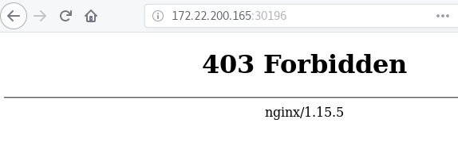

# ¿Qué nos aporta Kubernetes?: Actualizaciones continúas/Roolback, enrutamiento y volumenes

## Actualizaciones continúas

Podemos modificar nuestro despliegue para actualizar a la última versión de nuestra aplicación. Comprobamos que se crean 3 nuevos pods con la última versión de nuestra aplicación:

    kubectl set image deployment pagweb pagweb=josedom24/aplicacionweb:v2
    deployment.extensions/pagweb image updated

    kubectl get pods
    NAME                      READY   STATUS        RESTARTS   AGE
    pagweb-5d756cb86-2w2xq    1/1     Terminating   0          25m
    pagweb-5d756cb86-gwfgf    1/1     Terminating   0          21m
    pagweb-5d756cb86-wppxj    1/1     Terminating   0          21m
    pagweb-7f6d9648fc-6kzf4   1/1     Running       0          8s
    pagweb-7f6d9648fc-bhb2z   1/1     Running       0          2s
    pagweb-7f6d9648fc-r8vql   1/1     Running       0          5s

Y podemos acceder a la nueva versión de nuestra aplicación:

## Rollback de nuestra aplicación

Si por cualquier motivo quiero volver a la versión anterior de nuestro despliegue:

    kubectl rollout undo deployment/pagweb
    deployment.extensions/pagweb

    kubectl get pods
    NAME                      READY   STATUS        RESTARTS   AGE
    pagweb-5d756cb86-d4tn4    1/1     Running       0          12s
    pagweb-5d756cb86-fvrfc    1/1     Running       0          6s
    pagweb-5d756cb86-g6wsc    1/1     Running       0          9s
    pagweb-7f6d9648fc-6kzf4   1/1     Terminating   0          8m58s
    pagweb-7f6d9648fc-bhb2z   1/1     Terminating   0          8m52s
    pagweb-7f6d9648fc-r8vql   1/1     Terminating   0          8m55s

Y volveríamos tener la versión anterior de nuestra aplicación:

Tenemos un historial de versiones de nuestro despliegues y podemos volver a un estado anterior cuando lo necesitemos.

## Enrutando nuestras aplicaciones.

El recurso `Ingress Controller` nos ofrece un proxy inverso, que por medio de reglas de encaminamiento nos permite el acceso a nuestras aplicaciones por medio de nombres.

Necesitamos un fichero de configuración `ingress.yaml`:

    apiVersion: extensions/v1beta1
    kind: Ingress
    metadata:
      name: pagweb
    spec:
      rules:
      - host: pagweb.172.22.200.165.nip.io
        http:
          paths:
          - path: /
            backend:
              serviceName: pagweb
              servicePort: 80
    
Y ahora creamos el recurso ingress:

    kubectl create -f ingress.yaml 
    ingress.extensions/pagweb created

    kubectl get ingress
    NAME     HOSTS                          ADDRESS   PORTS   AGE
    pagweb   pagweb.172.22.200.165.nip.io             80      6s
 

Y podemos acceder a nuestra aplicación por medio del nombre que hemos asignado:

## Volúmenes persistentes en Kubernetes

El administrador del cluster debe crear un recurso `PersistentVolumen`, donde define el total de almacenamiento disponible en el cluster.

Nosotros hemos creado una unidad nfs compartida entre los nodos:

    kubectl get pv
    NAME     CAPACITY   ACCESS MODES   RECLAIM POLICY   STATUS      CLAIM   STORAGECLASS    REASON   AGE
    nfs-pv   5Gi        RWX            Recycle          Available                                     6s
Debemos reservar espacio en el `PersistentVolumen`, creando un recurso `PersistentVolumenClaim`, para ello utilizamos el fichero `pvc.yaml`:

    apiVersion: v1
    kind: PersistentVolumeClaim
    metadata:
      name: nfs-pvc
    spec:
      accessModes:
        - ReadWriteMany
      resources:
        requests:
          storage: 1Gi

Creamos el recurso:

    kubectl create -f pvc.yaml 
    persistentvolumeclaim/nfs-pvc created

    kubectl get pvc
    NAME      STATUS   VOLUME   CAPACITY   ACCESS MODES   STORAGECLASS   AGE
    nfs-pvc   Bound    nfs-pv   5Gi        RWX                           4s

Como podemos observar al crear el pvc se busca del conjunto de pv uno que cumpla sus requerimientos, y se asocian (status bound) por lo tanto el tamaño indicado en el pvc es el valor mínimo de tamaño que se necesita, pero el tamaño real será el mismo que el del pv asociado.

A continuación vamos a crear un deploy donde vamos a montar nuestro volumen, utilizamos el fichero `pod-deploy.yaml`:

    apiVersion: extensions/v1beta1
    kind: Deployment
    metadata:
      name: nginx
      labels:
        app: nginx
    spec:
      template:
        metadata:
          labels:
            app: nginx
        spec:
          containers:
          - image: nginx
            name: nginx
            ports:
            - name: http
              containerPort: 80
            volumeMounts:
            - mountPath: /usr/share/nginx/html
              name: nfs-vol
          volumes:
          - name: nfs-vol
            persistentVolumeClaim:
              claimName: nfs-pvc
      

Creamos el deploy y el servicio:

    kubectl create -f nginx-deploy.yaml 
    deployment.extensions/nginx created

    kubectl expose deploy nginx --port=80 --type=NodePort
    service/nginx exposed

    kubectl get deploy,service
    NAME                           DESIRED   CURRENT   UP-TO-DATE   AVAILABLE   AGE
    deployment.extensions/nginx    1         1         1            1           86s

    NAME                 TYPE        CLUSTER-IP      EXTERNAL-IP   PORT(S)        AGE
    service/nginx        NodePort    10.110.53.26    <none>        80:30196/TCP   15s
    
Comprobamos que al acceder a la aplicación no tenemos ninguna página:

Por último escribimos el contenido en el directorio compartido, y accedemos a la aplicación:

    echo "It works..." | ssh debian@172.22.200.165 'cat >> /var/shared/index.html' 
  

