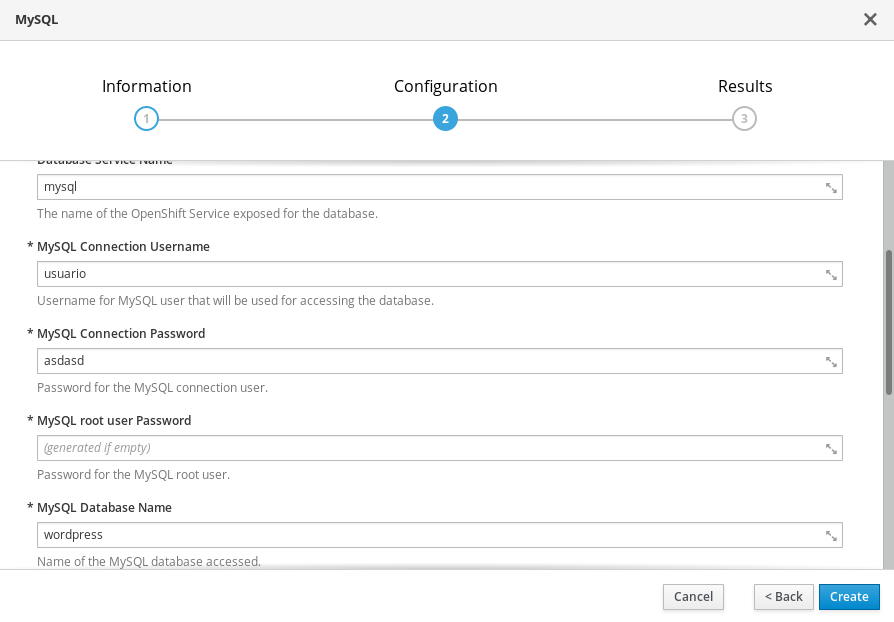
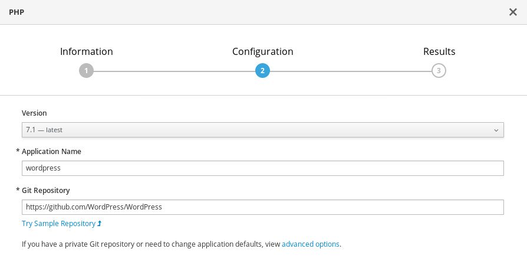

# Despliegue de Wordpress en OpenShift

En esta unidad vamos a instalar WordPress, un CMS escrito en PHP, en OpenShift aplicando todos los conocimientos que hemos estudiado en unidades anteriores:

## Creación de la base de datos

Vamos a crear un nuevo proyecto y en ella vamos a crear una aplicación con la base de datos mysql. Para ellos escogemos en el catálogo la imagen de mysql e indicamos las variables para su creación:

## Despliegue de WordPress

A continuación vamos a crear una aplicación PHP con el despliegue de WordPress para ello vamos a utilizar el repositorio oficial de la aplicación: `https://github.com/WordPress/WordPress`:

En este momento tenemos instalado WordPress pero sin almacenamiento persistente. Para trabajar con almacenamiento persistente en el próximo paso vamos a crear un volumen, pero antes vamos a cambiar la estrategia de despliegue de la aplicación:

* Por defecto la estrategia es **Rolling**: En este caso se crean los nuevos pods de la nueva versión edl despliegue se comprueban que funcionan y posteriormente se eliminan los pods de la versión anterior.
* Nosotros deseamos que la estrategia sea **Recreate**: En esta situación se eliminan los pods de la versión actual y posteriormente se crean los nuevos pods de la nueva versión. Si vamos a trabajar con volúmenes, necesitamos configurar este tipo de estrategia, ya que la primera nos da errores al intentar conectar el volumen a un nuevo pod cuando sigue conectado al anterior pod.

Para cambiar la estrategía: Elegímos el despliegue de wordpress y en el boton **Actions** elegimos la opción **Edit**:

    spec:
          containers:
            - command:
                - /opt/app-root/src/wp-content/run
    ...